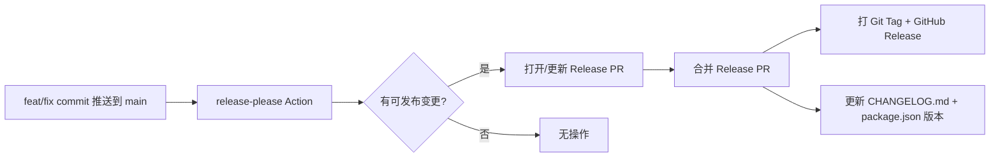

# 贡献指南

感谢关注 Orbit。本文说明如何提交代码、维护文档，以及版本发布流程。

---

## 开发环境

见 [README.md](../README.md#如何启动)。

---

## Commit 规范（Conventional Commits）

所有提交到 `main` 的 commit message 请遵循 [Conventional Commits](https://www.conventionalcommits.org/)，以便 **自动生成 CHANGELOG** 与语义化版本号。

### 格式

```
<type>(<scope>): <description>

[optional body]

[optional footer]
```

### Type 说明

| type | 含义 | 是否计入 CHANGELOG | 版本影响 |
|------|------|-------------------|----------|
| `feat` | 新功能 | ✅ 新功能 | minor ↑ |
| `fix` | Bug 修复 | ✅ 修复 | patch ↑ |
| `perf` | 性能优化 | ✅ 性能 | patch ↑ |
| `refactor` | 重构（无行为变化） | ✅ 重构 | patch ↑ |
| `docs` | 仅文档 | ✅ 文档 | 无（默认） |
| `chore` | 构建 / 依赖 / 杂项 | 隐藏 | 无 |
| `test` | 测试 | 可选 | 无 |
| `ci` | CI 配置 | 可选 | 无 |

带 `!` 或 footer `BREAKING CHANGE:` 视为破坏性变更 → **major** 版本升级。

### 示例

```bash
feat(search): add filter by content type
fix(comments): remap inline anchors after body edit
docs(roadmap): mark settings page as in progress
chore(deps): bump drizzle-orm to 0.45.2
feat(api)!: remove legacy markdown import endpoint

BREAKING CHANGE: /api/import-md removed, use db:import script
```

### Scope 建议

`diary` · `letter` · `memo` · `comments` · `search` · `auth` · `editor` · `api` · `deploy` · `roadmap` · `changelog`

---

## 文档维护

| 文档 | 何时更新 | 是否手改 |
|------|----------|----------|
| [docs/ROADMAP.md](./ROADMAP.md) | 功能状态变化、排期调整 | ✅ 手改 |
| [docs/ARCHITECTURE.md](./ARCHITECTURE.md) | 架构、表结构、目录变更 | ✅ 手改 |
| [CHANGELOG.md](../CHANGELOG.md) | 每次发布 | ❌ **由 release-please 自动生成** |
| [README.md](../README.md) | 启动方式、项目定位变化 | ✅ 手改 |

**不要手动编辑 CHANGELOG 中尚未发布的 `[Unreleased]` 区块**；release-please 会在 Release PR 中统一更新。

功能 PR 合并前请确认：

- [ ] 若涉及功能增减，已更新 `docs/ROADMAP.md` 对应行状态
- [ ] commit message 符合 Conventional Commits
- [ ] 若改架构，已更新 `docs/ARCHITECTURE.md`

---

## 发布流程（Release Workflow）

Orbit 使用 [release-please](https://github.com/googleapis/release-please) 自动管理版本与 CHANGELOG。

### 流程



### 配置文件

| 文件 | 作用 |
|------|------|
| `release-please-config.json` | CHANGELOG 分区、release 类型 |
| `.release-please-manifest.json` | 当前版本号 |
| `.github/workflows/release.yml` | 触发 release-please |

### 维护者操作

1. 日常开发：正常 `feat:` / `fix:` commit 合并到 `main`
2. release-please 自动创建 **Release PR**（标题如 `chore(main): release 0.1.0`）
3. Review Release PR 中的 CHANGELOG 与版本号
4. **合并 Release PR** → 自动创建 GitHub Release 与 Git tag
5. `deploy.yml` 与 `release.yml` 独立运行：部署不依赖发版

### 首次启用（一次性）

本仓库在引入 release-please 前已有开发历史，基线版本 **v0.0.1** 见 [CHANGELOG.md](../CHANGELOG.md)。

合并 release 工作流后，维护者需在 `main` 打基线 tag（仅一次）：

```bash
git tag v0.0.1
git push origin v0.0.1
```

然后在 GitHub **Releases** 页面基于 `v0.0.1` 创建 Release，正文可粘贴 CHANGELOG `0.0.1` 章节。

此后每次 `feat` / `fix` 合并到 `main`，release-please 会自动累积变更并打开 Release PR。

### 版本策略

- `0.x.y`：核心功能快速迭代期
- `feat` → minor +1（`0.1.0` → `0.2.0`）
- `fix` / `perf` / `refactor` → patch +1（`0.1.0` → `0.1.1`）
- `BREAKING CHANGE` → major +1

---

## Pull Request

使用 PR 模板（`.github/pull_request_template.md`）填写变更说明与文档检查项。

推荐分支命名：`feat/xxx`、`fix/xxx`、`docs/xxx`。
